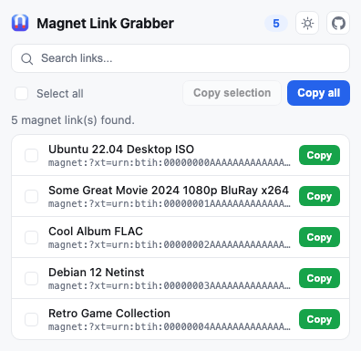
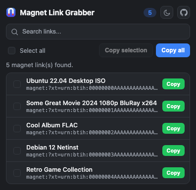
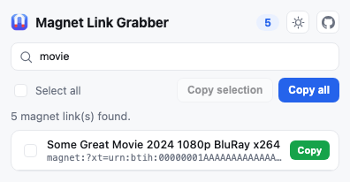
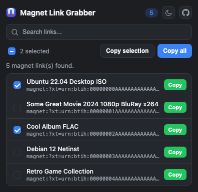

# Magnet Link Grabber

Chrome extension that grabs every magnet link (`magnet:?xt...`) found on a web page, so you can copy them easily.

> ⚠️ **Not yet published on the Chrome Web Store.** For now the extension can only be installed manually in developer mode — see [Installation](#installation-developer-mode) below.

  
  

## Features

- Scans `<a href="magnet:?xt...">` links on the active tab
- Lists the links found in a popup, with the torrent name when available (`dn=` parameter)
- Live search filter over the link name/URL
- Per-link checkboxes with "select all" and "copy selection"
- "Copy all" button to copy every link (one per line) to the clipboard
- Individual "Copy" button for each link
- Light / dark / system theme toggle

### Search

Type a few words to filter the list — matching is order-independent, so `movie 1080p` finds `Some Great Movie 2024 1080p BluRay x264`.

  

### Selecting links

Check the boxes you need (or "Select all") and hit "Copy selection" to copy only those links.

  

## Installation (developer mode)

1. Open `chrome://extensions`
2. Enable "Developer mode" (top right)
3. Click "Load unpacked"
4. Select this project's folder

## Usage

1. Open a page containing magnet links
2. Click the extension icon
3. Copy the link(s) you want

## Project structure

- `manifest.json` — extension configuration (Manifest V3)
- `popup.html` / `popup.css` / `popup.js` — popup UI and logic
- `icons/` — extension icons
- `screenshots/` — images used in this README
